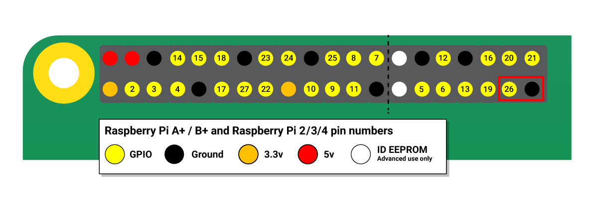

# pi_mp3_doorbell
Code to use a Raspberry Pi as a doorbell replacement and play a mp3 file as the doorbell sound

This is pretty simple code that can be adapted to use on many platforms, but since I had a Pi sitting around, I figured I would put it to use.

My doorbell is terrible here, which is why I decided to do this in the first place.

The mp3 file I'm using is a cat meowing, but you can basically use any mp3 file you want, so the options as limitless. Heck, you can use an mp3 file of a dog barking and scare anyone who rings the doorbell.

There is only two pieces of code: 

doorbell.sh - This bash script which runs an indefinite loop and checks every half a second for a doorbell press. If it has been pressed, and the last time the doorbell was
pressed was over a set timeout, then it triggers mpg123 to play a ringtone. The timeout is so that if someone presses the doorbell multiple times, it won't play the same mp3 file multiple times in sequence.

doorbell.service - This is what starts doorbell.sh on startup. If you are using init.d, simply add something like /usr/bin/sh {path where doorbell.sh resides}/doorbell.sh &

I used mpg123 to play the mp3 file, but feel free to use any other mp3 player to do this.

Pi specific things:

Image source: https://www.raspberrypi.org/documentation/usage/gpio/

I used the bottom 2 pins, GPIO26 and ground and the code is setup for this. IF you want to use a different GPIO pin, change the pin variable in doorbell.sh and you should be golden.

This page explains how to control the 3.5mm jack through the command line:
http://raspberrypi-aa.github.io/session3/audio.html#:~:text=To%20change%20the%20volume%2C%20run,Route%20or%20Playback%20Switch%20controls.

I installed Raspbian, and everything worked out of the box.

Happy tinkering !
